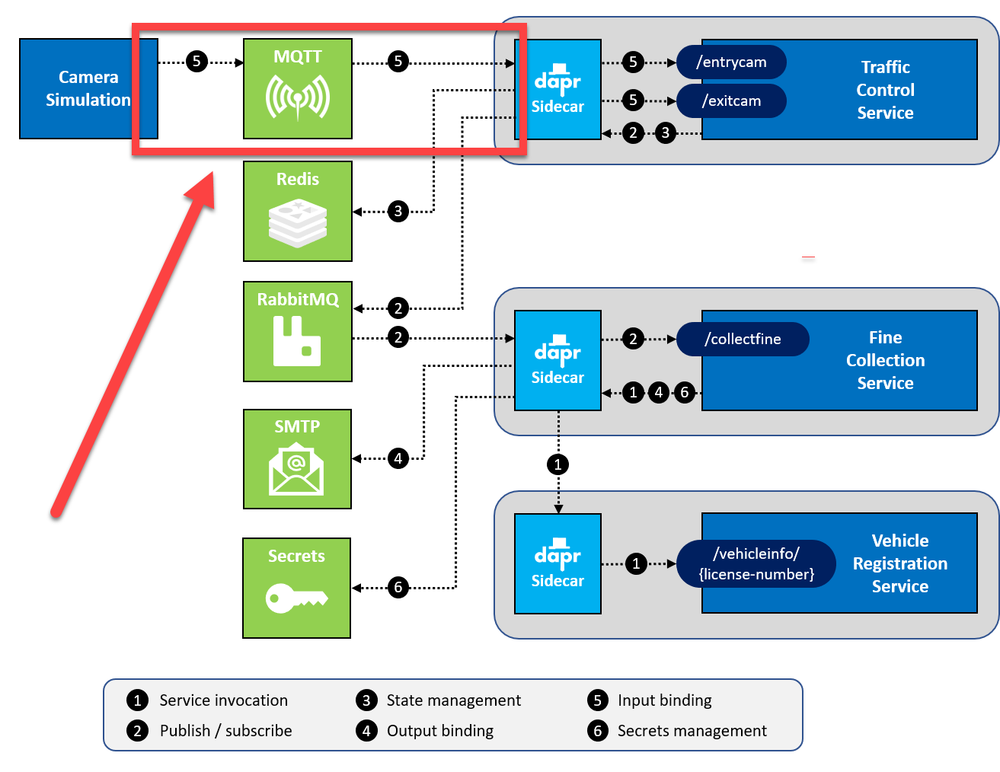

# Assignment 6 - Add a Dapr input binding

## Assignment goals

You will add code to the TrafficControlService to leverage a Dapr input binding to send entry- and exit-cam messages. The following diagram depicts the scenario:

   

## Step 1: Use the Dapr input binding in the TrafficControlService

Start by inspecting vehicle entry and exit methods:

1. Open the file `src/TrafficControlService/Controllers/TrafficController.cs` in VS Code.

1. Inspect the `VehicleEntry` and `VehicleExit` methods.

And you're done! That's right, you don't need to change anything in order to use an input binding. The binding will invoke the web API operations across the TrafficControlService based on the binding name specified in the component configuration. The TrafficControlService will have no knowledge of Dapr binding. It's just another HTTP call.

## Step 2: Run the Mosquitto MQTT broker

You'll use [Mosquitto](https://mosquitto.org/), a lightweight MQTT broker, as the MQTT broker between the Simulation and TrafficControlService. You'll run Mosquitto from a Docker container.

In order to connect to Mosquitto, you need to pass in a custom configuration file when starting it. With Docker, you can pass a configuration file when starting a container using a *Volume mount*. The folder `src/Infrastructure/mosquitto` already contains a config file you can use.

1. Open the terminal window in VS Code and make sure the current folder is `src/Infrastructure/mosquitto`.

1. Start a Mosquitto MQTT container by entering the following command:
**When running on Windows**:

   ```console
   docker run -d -p 1883:1883 -p 9001:9001 -v $pwd/:/mosquitto/config/ --name dtc-mosquitto eclipse-mosquitto
   ```

   **When running on Mac or Linux**:

   ```console
   docker run -d -p 1883:1883 -p 9001:9001 -v $(pwd)/:/mosquitto/config/ --name dtc-mosquitto eclipse-mosquitto
   ```

This will pull the docker image `eclipse-mosquitto` from Docker Hub and start it. The name of the container will be `dtc-mosquitto`. The server will be listening for connections on port `1883` for MQTT traffic.

The `-v` flag specifies a Docker volume mount. It mounts the current folder (containing the config file) as the ``/mosquitto/config/` folder in the container. Mosquitto reads its config file from that folder.  

If everything goes well, you should see some output like this:


> If you see any errors, make sure you have access to the Internet and are able to download images from Docker Hub. See [Docker Hub](https://hub.docker.com/) for more info.

The container will keep running in the background. If you want to stop it, enter the following command:

```console
docker stop dtc-mosquitto
```

You can then start the container later by entering the following command:

```console
docker start dtc-mosquitto
```

When you are done with the class, you can remove it by entering the following command:

```console
docker rm dtc-mosquitto -f
```

Keep in mind that once you remove, it's gone. You'll need to start it again with the `docker run` command shown at the beginning of this step.

> For your convenience, the `src/Infrastructure` folder contains Powershell scripts for starting the infrastructural components you'll use throughout the workshop. You can use the `src/Infrastructure/maildev/start-maildev.ps1` script to start the MailDev container.
>
> You can also start all the infrastructural containers at once (also for assignments to come) with the `src/Infrastructure/start-all.ps1` script.

## Step 3: Configure the input binding

In this step you will add two Dapr binding component configuration files to the custom components folder you created in Assignment 3.

First, create an input binding for the `/entrycam` operation:

1. Add a new file in the `src/dapr/components` folder named `entrycam.yaml`.

1. Open the file in VS Code.

1. Paste this snippet into the file:

   ```yaml
   apiVersion: dapr.io/v1alpha1
   kind: Component
   metadata:
     name: entrycam
     namespace: dapr-trafficcontrol
   spec:
     type: bindings.mqtt
     version: v1
     metadata:
     - name: url
       value: mqtt://localhost:1883
     - name: topic
       value: trafficcontrol/entrycam
   scopes:
     - trafficcontrolservice
   ```

   In this configuration file, you specify the binding type MQTT (`bindings.mqtt`). In the `metadata` section, you describe how to connect to Mosquitto server container running on `localhost` on port `1883` . Note also how the `topic` is configured in metadata: `trafficcontrol/entrycam`. In the `scopes` section, you specify that only the TrafficControlService should subscribe to the MQTT topic.

It's important to note the `name` of the binding. This name must be the same as that in the web API URL that'll be invoked on your service. In this example, it's `/entrycam`.

Next, create an input binding for the `/exitcam` operation:

1. Add a new file in the `src/dapr/components` folder named `exitcam.yaml`.

1. Open this file in VS Code.

1. Paste this snippet into the file:

   ```yaml
   apiVersion: dapr.io/v1alpha1
   kind: Component
   metadata:
     name: exitcam
     namespace: dapr-trafficcontrol
   spec:
     type: bindings.mqtt
     version: v1
     metadata:
     - name: url
       value: mqtt://localhost:1883
     - name: topic
       value: trafficcontrol/exitcam
   scopes:
     - trafficcontrolservice    
   ```

Now with input bindings configured, it's time to change the Camera Simulation so it'll send MQTT messages to Mosquitto.

## Step 4: Send MQTT messages from the Camera Simulation

In this step, you'll change the Camera Simulation so it sends MQTT messages instead of HTTP requests:

1. Open the terminal window in VS Code and make sure the current folder is `src/Simulation`.

1. Add a reference to the `System.Net.Mqtt` library:

   ```console
   dotnet add package System.Net.Mqtt --prerelease
   ```

1. Open the file `src/Simulation/CameraSimulation.cs` file in VS Code.

1. Inspect the code in this file.

As you can see, the simulation receives an `ITrafficControlService` instance injected into its constructor. The simulation uses this proxy (i.e., helper class) to send entry- and exit-cam messages to the TrafficControlService.

1. Open the file `src/Simulation/Proxies/HttpTrafficControlService.cs` in VS Code and inspect the code.

The proxy uses HTTP to send the message to the TrafficControlService. You will replace this now with an implementation that uses MQTT:

1. Add a new file in the `src/Simulation/Proxies` folder named `MqttTrafficControlService.cs`.

1. Paste the following code into this file:

   ```csharp
   using System;
   using System.Net.Mqtt;
   using System.Text;
   using System.Text.Json;
   using Simulation.Events;
   
   namespace Simulation.Proxies
   {
       public class MqttTrafficControlService : ITrafficControlService
       {
           private readonly IMqttClient _client;
   
           public MqttTrafficControlService(int camNumber)
           {
               // connect to mqtt broker
               var mqttHost = Environment.GetEnvironmentVariable("MQTT_HOST") ?? "localhost";
               _client = MqttClient.CreateAsync(mqttHost, 1883).Result;
               var sessionState = _client.ConnectAsync(
                   new MqttClientCredentials(clientId: $"camerasim{camNumber}")).Result;
           }
   
           public void SendVehicleEntry(VehicleRegistered vehicleRegistered)
           {
               var eventJson = JsonSerializer.Serialize(vehicleRegistered);
               var message = new MqttApplicationMessage("trafficcontrol/entrycam", Encoding.UTF8.GetBytes(eventJson));
               _client.PublishAsync(message, MqttQualityOfService.AtMostOnce).Wait();
           }
   
           public void SendVehicleExit(VehicleRegistered vehicleRegistered)
           {
               var eventJson = JsonSerializer.Serialize(vehicleRegistered);
               var message = new MqttApplicationMessage("trafficcontrol/exitcam", Encoding.UTF8.GetBytes(eventJson));
               _client.PublishAsync(message, MqttQualityOfService.AtMostOnce).Wait();
           }
       }
   }
   ```

1. Inspect the new code.

It now uses the `System.Net.Mqtt` library to connect and send messages to the MQTT broker.

It's time to wire up the new MQTT proxy to the Simulation service and remove the older HTTP implementation:

1. Open the file `src/Simulation/Program.cs` in VS Code.

1. Remove the first line of the `Main` method where an instance of the `HttpClient` instance is created.

1. Replace the creation of a `HttpTrafficControlService` instance with the creation of a `MqttTrafficControlService` instance:

   ```csharp
   var trafficControlService = new MqttTrafficControlService(camNumber);
   ```

1. Open the terminal window in VS Code and make sure the current folder is `src/Simulation`.

1. Check all your code changes are correct by building the code. Execute the following command in the terminal window:

```console
dotnet build
```

If you see any warnings or errors, review the previous steps to make sure the code is correct.

Now you're ready to test the application.

## Step 5: Test the application

You're going to start all the services now. You specify the custom components folder you've created on the command-line using the `--components-path` flag. By doing so, Dapr will use the configuration files inside the folder:

1. Make sure no services from previous tests are running (close the terminal windows).

1. Make sure all the Docker containers introduced in the previous assignments are running (you can use the `src/Infrastructure/start-all.ps1` script to start them).

1. Open the a **new** terminal window in VS Code and make sure the current folder is `src/VehicleRegistrationService`.

1. Enter the following command to run the VehicleRegistrationService with a Dapr sidecar:

   ```console
   dapr run --app-id vehicleregistrationservice --app-port 6002 --dapr-http-port 3602 --dapr-grpc-port 60002 --components-path ../dapr/components dotnet run
   ```

1. Open a **second** new terminal window in VS Code and change the current folder to `src/FineCollectionService`.

1. Enter the following command to run the FineCollectionService with a Dapr sidecar:

   ```console
   dapr run --app-id finecollectionservice --app-port 6001 --dapr-http-port 3601 --dapr-grpc-port 60001 --components-path ../dapr/components dotnet run
   ```

1. Open a **third** new terminal window in VS Code and change the current folder to `src/TrafficControlService`.

1. Enter the following command to run the TrafficControlService with a Dapr sidecar:

   ```console
   dapr run --app-id trafficcontrolservice --app-port 6000 --dapr-http-port 3600 --dapr-grpc-port 60000 --components-path ../dapr/components dotnet run
   ```

1. Open a **fourth** new terminal window in VS Code and change the current folder to `src/Simulation`.

1. Start the simulation:

   ```console
   dotnet run
   ```

You should see the same logs as before.

To peak into the Mosquitto server, open a **new** terminal window and execute the following command:

```console
docker logs dtc-mosquitto
```

You will connect to the server and see its logs:


## Next assignment

Make sure you stop all running processes and close all the terminal windows in VS Code before proceeding to the next assignment.

Go to [assignment 7](../Assignment07/README.md).
