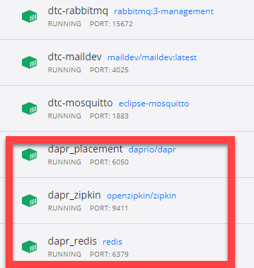

# Known Issues

Here are common issues students sometimes experience with the Dapr workshop.

## "Docker daemon is not running"

Experienced when starting a Dapr service:

   > "error during connect: This error may indicate that the docker daemon is not running. Get http: open //./pipe/docker_engine: The system cannot find the file specified."

- Make sure that Docker Desktop is running.

## cliPID Error

Experienced when starting a Dapr service:

 > Could not update sidecar metadata for cliPID: PUT http://127.0.0.1:3602/v1.0/metadata/cliPID giving up after 5 attempts -- Docker running?

- Typically caused when a container is not running.
  - Make sure Docker Desktop is started
  - The workshop requires **6 running containers**:
  
  

  - The containers in **red** are installed by Dapr.
  - The other 3 containers must be provisioned manually or by script. The scripts are located in `src/Infrastructure/` folder.

## "RabbitMQ - channel not initialized"

Error message that appears in the Dapr logging when starting a Dapr service:

 > level=error msg="rabbitmq pub/sub: error in subscription for finecollectionservice-collectfine, channel not initialized"

- Make sure that the RabbitMQ container is running: Invoke the `start-rabbitmq.ps1` script in the `src/Infrastructure/rabbitmq` folder.

## "pwd" includes invalid characters

Sometimes experienced when starting the `mosquitto` container:

- Fix by replacing `$pwd` argument with `"%cd%"` as follows:

   >  docker run -d -p 1883:1883 -p 9001:9001 -v "%cd%"/:/mosquitto/config/ --name dtc-mosquitto eclipse-mosquitto

## Simulation service freezes after starting cameras:

- Make sure that the TrafficControlService is running.
